# Clinical Trial Access & Recruitment Competition Intelligence — Full Project Documentation

> **Planning signal only.** Every figure in this document is derived from public
> ClinicalTrials.gov registry listings. Outputs are *potential competition signals* for
> feasibility review — **not** recruitment forecasts, patient availability estimates,
> site-capacity measurements, or trial-outcome judgments. No contact or investigator
> information is collected or shown anywhere in this project.

Documentation snapshot: built and verified against the live warehouse of **2026-07-24**.

---

## Table of contents

1. [Project at a glance](#1-project-at-a-glance)
2. [The problem and the decision supported](#2-the-problem-and-the-decision-supported)
3. [System architecture](#3-system-architecture)
4. [Repository layout](#4-repository-layout)
5. [Data flow through the medallion layers](#5-data-flow-through-the-medallion-layers)
6. [Ingestion design (bronze)](#6-ingestion-design-bronze)
7. [Normalization design (silver)](#7-normalization-design-silver)
8. [Warehouse design (gold — dbt on DuckDB)](#8-warehouse-design-gold--dbt-on-duckdb)
9. [Dimensional data model](#9-dimensional-data-model)
10. [The feasibility priority score](#10-the-feasibility-priority-score)
11. [Streamlit dashboard](#11-streamlit-dashboard)
12. [Data quality framework](#12-data-quality-framework)
13. [Clinical interpretation guardrails](#13-clinical-interpretation-guardrails)
14. [Testing and verification](#14-testing-and-verification)
15. [Runbook — commands and operations](#15-runbook--commands-and-operations)
16. [Configuration reference](#16-configuration-reference)
17. [Known limitations](#17-known-limitations)
18. [Roadmap](#18-roadmap)
19. [Documentation index](#19-documentation-index)
20. [Glossary](#20-glossary)

---

## 1. Project at a glance

| Property | Value |
|---|---|
| Domain | Clinical-operations site-feasibility intelligence |
| Therapeutic area | Config-driven indication profiles (`config/profiles/`: ADRD, NSCLC oncology, plus an ingest-only full catalog) |
| Geography | United States (raw data keeps all countries; marts are U.S.-only) |
| Source | [ClinicalTrials.gov API v2](https://clinicaltrials.gov/data-api/api) (public, no key) |
| Stack | Python 3.11+ · uv · DuckDB · dbt · Streamlit · Plotly · pytest · ruff |
| Architecture | Local-first medallion: bronze JSON → silver Parquet → gold dbt marts |
| Automated tests | dbt data tests + pytest suite: the counts, their date and the commands that regenerate them are in §14 (one place, on purpose — a second copy is the drift this document has already been burned by) |
| dbt resources | 32 models (8 staging views, 8 intermediate views, 16 mart tables) + 4 seeds + 4 analyses (same 2026-09-07 UTC parse) |

**Live warehouse figures (single snapshot, 2026-07-24):**

| Measure | Value |
|---|---|
| Versioned trial records (`dim_trial`) | 2,592 |
| Currently recruiting | 419 |
| Not yet recruiting | 157 |
| Active, not recruiting | 139 |
| Completed | 1,877 |
| U.S. states/territories with listed sites | 50 |
| Distinct listed facilities (best-effort normalized) | 6,241 |
| Facilities listed on >1 recruiting trial | 301 |
| Trial × facility × snapshot rows | 12,244 |
| Lead sponsors | 1,743 |
| Distinct condition terms | 1,173 |
| Ranked condition × state × phase segments | 449 |
| Segments in `review`/`priority_review` bands | 75 |

Trial status mix in the current snapshot:

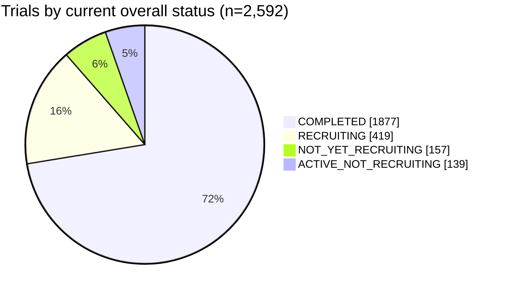

Phase mix (registry-reported; `NOT_APPLICABLE` dominates because many dementia
studies are behavioral/device interventions):

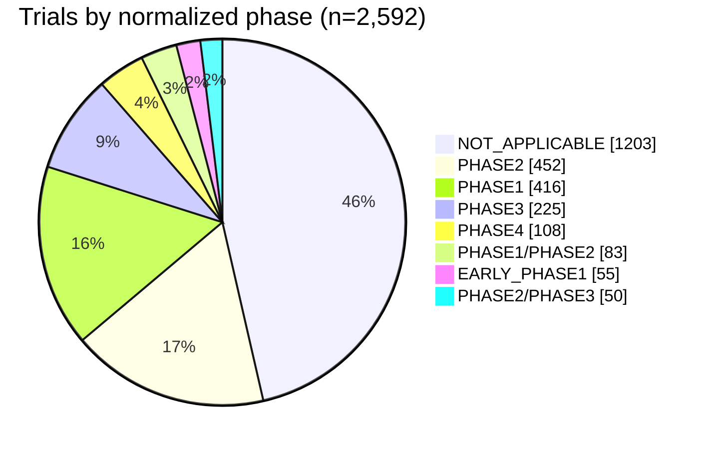

---

## 2. The problem and the decision supported

**Stakeholder:** Director of Clinical Operations / Head of Site Feasibility at a
sponsor or CRO.

**Question:** *"Which condition–geography–phase combinations should receive a
feasibility review before we invest in activating or expanding clinical trial sites?"*

Site activation is expensive and slow. Before committing startup resources, a
feasibility team wants to know where the public registry already shows:

- high **competing-study density** (many recruiting trials in the same segment),
- recent **trial growth** (new studies entering the segment),
- concentrated **sponsor activity** (a few sponsors dominating listings),
- repeated **site participation** (the same facilities listed across many trials),
- and how much **confidence** the underlying records deserve.

This project turns those public signals into a transparent, ranked
**Feasibility Review Priority Queue** — a to-do list for *human* feasibility review,
never an automated verdict.

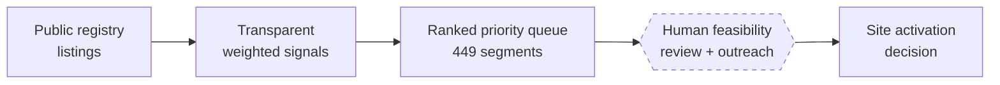

The dashed step is the point: the pipeline **stops** at prioritization. Decisions
require qualified clinical-operations judgment and primary feasibility outreach.

---

## 3. System architecture

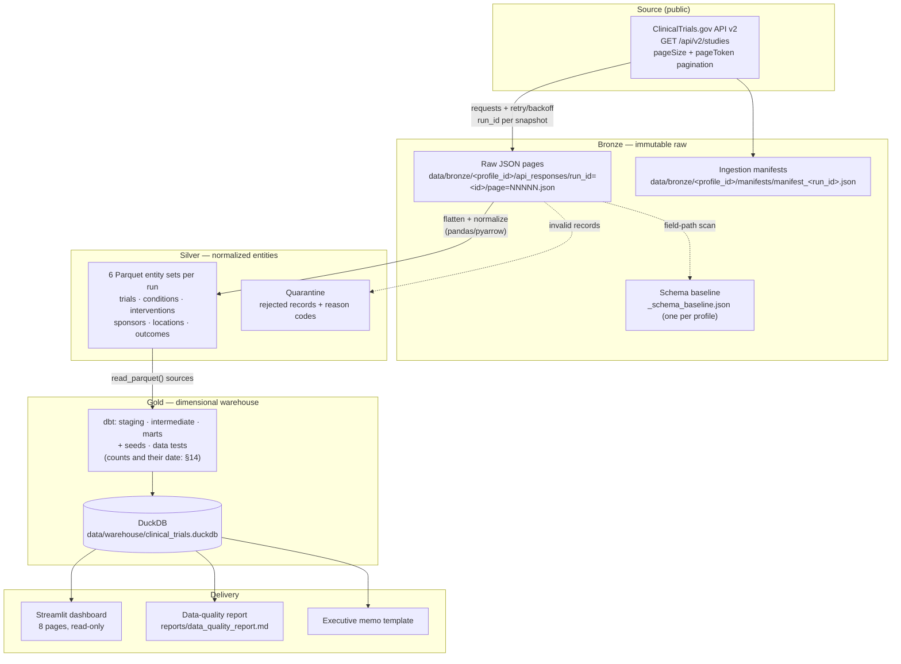

**Key architectural decisions**

| Decision | Rationale |
|---|---|
| Bronze is immutable | Reproducibility: any downstream layer can be rebuilt byte-identically from raw pages |
| Snapshot-based history | The API serves only *current* records; history is constructed by retaining weekly snapshots keyed by `run_id` |
| DuckDB + dbt locally | Zero-cost, fully tested warehouse; SQL is portable to BigQuery/Snowflake later |
| All query parameters in YAML | `config/project_config.yml` — nothing is hard-coded in ingestion code |
| Dashboard is read-only | Connection opened `read_only=True`; the UI can never mutate the warehouse |
| Contacts deliberately excluded | `stg_trial_contacts` is an intentionally empty model (`where 1=0`) — a mechanical privacy guardrail |

---

## 4. Repository layout

```
cti-dashboard/
├── Makefile                      # reproducible entry points (make help)
├── pyproject.toml                # uv-managed dependencies + tool config
├── README.md                     # front-door documentation
├── PROJECT_DOCUMENTATION.md      # this file
├── .env.example                  # local overrides (no secrets needed)
│
├── config/
│   ├── profiles/                 # pluggable indication profiles (adrd.yml, full_catalog.yml, ...)
│   │   ├── adrd.yml              # ADRD indication profile (scope, query, bronze paths)
│   │   └── full_catalog.yml      # opt-in full-registry snapshot profile (ingest-only)
│   ├── shared_paths.yml          # shared silver, gold, and DuckDB paths across profiles
│   ├── condition_taxonomy.yml    # ADRD condition-group mapping rules
│   ├── geography_rules.yml       # US state normalization rules
│   ├── score_weights.yml         # feasibility score weights + bands
│   └── roi_assumptions.yml       # editable scenario-calculator assumptions
│
├── src/
│   ├── cli.py                    # python -m src.cli {ingest,transform,quality-report,orchestrate}
│   ├── config.py                 # typed pydantic config with .env overrides
│   ├── profiles.py               # IndicationProfile dataclass + ProfileRegistry discovery
│   ├── ingest/                   # ctg_client, pagination, retry_policy,
│   │                             # snapshot_manifest, validate_api_payload,
│   │                             # extract_studies (orchestrator)
│   ├── transform/                # flatten_studies, normalize_conditions,
│   │                             # normalize_locations, export_parquet,
│   │                             # build_silver_entities (orchestrator)
│   ├── quality/                  # profiling, schema_drift, reconciliation,
│   │                             # data_quality_report
│   ├── analysis/roi_scenarios.py # pure-arithmetic scenario calculator
│   └── utils/                    # dates, hashing, logging, paths, text
│
├── dbt_clinical_trials/
│   ├── dbt_project.yml           # schemas + feasibility band vars
│   ├── profiles.yml              # DuckDB target
│   ├── macros/                   # generate_surrogate_key, normalize_text,
│   │                             # parse_partial_date, safe_divide
│   ├── seeds/                    # status_mapping, phase_mapping,
│   │                             # feasibility_score_weights
│   ├── models/staging/           # 8 views over silver Parquet (+ sources, tests)
│   ├── models/intermediate/      # 8 views (status history, concentration, ...)
│   ├── models/marts/             # 5 dims, 2 facts, 2 bridges, 7 marts (+ tests)
│   ├── tests/                    # 13 singular SQL assertion files (measured
│   │                             # 2026-09-07: `ls dbt_clinical_trials/tests/*.sql`;
│   │                             # §14 carries the dbt total of 138, which is not this)
│   └── analyses/                 # 4 compiled-but-not-materialized analyses
│
├── dashboard/
│   ├── app.py                    # Overview page
│   ├── components/               # data (cached queries), guardrails, filters, profile
│   └── pages/                    # 8 numbered pages (queue → trial similarity)
│
├── tests/                        # pytest suite (count and its date: §14)
├── docs/                         # 16 (`git ls-files "docs/*.md"`); §19 indexes 10 + README.md
├── data/                         # git-ignored: bronze/<profile_id>/ silver/ gold/ warehouse/
└── reports/                      # generated data-quality report
```

---

## 5. Data flow through the medallion layers

```mermaid
flowchart LR
    subgraph B["Bronze (JSON, immutable)<br/>data/bronze/&lt;profile_id&gt;/"]
        direction TB
        b1["api_responses/run_id=&lt;id&gt;/<br/>page=00000.json …"]
        b2["manifests/manifest_&lt;run_id&gt;.json<br/>pages, counts, query hash, profile, status"]
    end
    subgraph S["Silver (Parquet, per run)"]
        direction TB
        s1["silver_trials/run_id=&lt;id&gt;.parquet"]
        s2["silver_trial_locations/…"]
        s3["silver_trial_sponsors/…"]
        s4["silver_trial_conditions/…"]
        s5["silver_trial_interventions/…"]
        s6["silver_trial_outcomes/…"]
    end
    subgraph G["Gold (DuckDB tables/views)"]
        direction TB
        g1["main_staging (8 views)"]
        g2["main_intermediate (8 views)"]
        g3["main_marts (16 tables)"]
        g4["main_seeds (4 mapping tables)"]
    end
    B -->|"make transform<br/>(flatten, normalize, quarantine)"| S
    S -->|"make dbt-run<br/>(read_parquet sources)"| G
```

Grain contract at every layer:

| Layer | Object | Grain |
|---|---|---|
| Bronze | JSON page | API page × ingestion run |
| Silver | `trials` | NCT ID × indication profile × ingestion run |
| Silver | `trial_locations` | NCT ID × facility × city × state × profile × run |
| Gold | `dim_trial` | indication profile × NCT ID (current record) |
| Gold | `fct_trial_snapshot` | indication profile × NCT ID × snapshot date |
| Gold | `fct_trial_site` | indication profile × NCT ID × facility × city × state × snapshot date |
| Gold | `mart_feasibility_priority_queue` | profile × condition group × state × phase × latest snapshot |

The authoritative per-model grain statements live in the dbt yml files
(`dbt_clinical_trials/models/**/_*.yml`), and the composite key is enforced by
the `unique` tests there plus `tests/test_dbt_fixture_build.py`.

---

## 6. Ingestion design (bronze)

One ingestion run = one dated snapshot of the full query result, stored verbatim.

```mermaid
sequenceDiagram
    participant U as make ingest
    participant O as extract_studies
    participant C as ctg_client (requests)
    participant A as ClinicalTrials.gov API v2
    participant D as data/bronze/&lt;profile_id&gt;/

    U->>O: run_ingestion(condition, full_refresh, max_pages, profile)
    O->>O: incremental check — recent completed run<br/>for same query hash? reuse & exit
    O->>O: mint run_id (UTC compact timestamp + uuid8)
    loop until no nextPageToken
        O->>C: GET /studies?query.cond=…&pageSize=100&pageToken=…
        C->>A: request (timeout 30s)
        A-->>C: JSON page (+ totalCount on page 1)
        Note over C: on 429/5xx: exponential backoff,<br/>max 5 retries
        C-->>O: validated payload
        O->>D: write page=NNNNN.json (immutable)
    end
    O->>D: write manifest_&lt;run_id&gt;.json<br/>(pages, study count, totalCount,<br/>query hash, profile, status=success)
    O-->>U: exit 0
```

Properties worth noting:

- **Idempotent by default** — `incremental` mode refuses to silently re-download a
  query completed within the reuse window (24 h); `make full-refresh` overrides.
- **Honest partials** — a run capped by `--max-pages` or interrupted mid-way is
  marked `partial`/`failed` in its manifest and **excluded from analytics**.
- **Verifiable** — the manifest records the canonical `query_hash` and the API's
  `totalCount`, every silver row carries `source_json_hash` (SHA-256 of the study
  JSON), and both are later reconciled against silver and gold row counts (§12).
- Last full pull recorded here: **26 pages, 2,592 studies** (the 2026-07-24
  snapshot above), matching the API `totalCount` exactly. Later runs are recorded
  with their own dates in [`docs/DEPLOY_FLY.md`](docs/DEPLOY_FLY.md).

## 7. Normalization design (silver)

`python -m src.cli transform --profile <id>` (or `make transform-nsclc` for the
one profile with a dedicated target) flattens each bronze run of one profile into
the typed Parquet entity sets listed in `ENTITY_NAMES`
(`src/transform/build_silver_entities.py`); the same tuple is the source of
truth for `dbt_clinical_trials/models/staging/_sources.yml`.

| Entity (directory under `data/silver/`) | Contents | Normalization applied |
|---|---|---|
| `silver_trials` | One row per study: status, phase, dates, enrollment, sponsor | partial-date parsing (`2026`, `2026-07`), phase mapping, text cleanup |
| `silver_trial_locations` | Listed facilities with city/state/zip/status | state → USPS 2-letter code, facility/city casefold+trim (best-effort) |
| `silver_trial_sponsors` | Lead sponsor + collaborators with class | role normalized to `lead_sponsor` / `collaborator` |
| `silver_trial_conditions` | Registry condition terms | mapped to the profile's condition groups via its `taxonomy:` profile key (`config/profiles/<id>.yml` → e.g. `config/condition_taxonomy.yml`), with confidence flag |
| `silver_trial_interventions` | Intervention name + type | text normalization |
| `silver_trial_outcomes` | Primary/secondary outcome measures | text normalization |

Records that fail structural validation (missing NCT ID, unparseable payload) go to
that profile's own quarantine directory — `paths.quarantine` in
`config/profiles/<id>.yml`, e.g. `data/bronze/adrd/manifests/quarantine/` — with
machine-readable **reason codes**: never silently dropped.
Every silver row carries `ingestion_run_id`, `indication_profile_id` and
`source_json_hash` lineage columns.

---

## 8. Warehouse design (gold — dbt on DuckDB)

Simplified dbt DAG (arrows flow downstream):

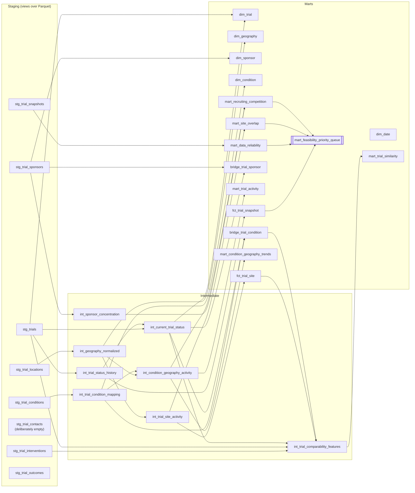

Seeds (version-controlled mapping tables, `dbt_clinical_trials/seeds/`):
`status_mapping` (status → is_active / is_recruiting flags), `phase_mapping`
(registry phase → order), `feasibility_score_weights` (the feasibility score's
weight vector — see §10) and `similarity_score_weights` (the trial-similarity
score's weight vector).

Project macros (`dbt_clinical_trials/macros/`): `generate_surrogate_key` (MD5 of
concatenated inputs), `normalize_text`, `parse_partial_date`, `parse_age_years`,
`safe_divide` (null-safe denominators) and `similarity_components` (the pairwise
comparability flags).

Four analyses (compiled, not materialized) provide ready-made review queries:
top priority segments, sponsor landscape, site-overlap hotspots, reliability trend.

---

## 9. Dimensional data model

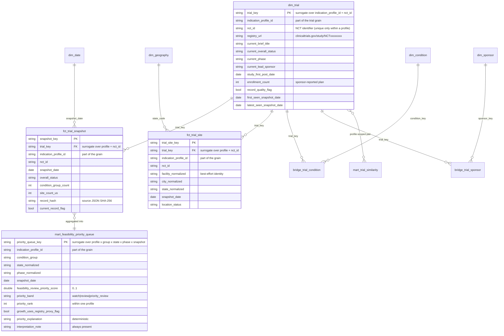

Bridges resolve the many-to-many relationships (a trial lists many conditions and
sponsors) and are scoped to each trial's **current** snapshot so dimension joins
never double-count history. Every relationship above is profile-scoped: a trial
that two profiles both list is two `dim_trial` rows, deliberately, so one
profile's status is never attributed to the other.

---

## 10. The feasibility priority score

The centerpiece mart ranks every **condition group × U.S. state × phase** segment
*within one indication profile*: normalization, banding and `priority_rank` are all
computed per profile, because two registry queries have different denominators and
additive ranks across them would be meaningless.

**Formula** (all inputs min-max normalized to [0, 1] within the latest snapshot of
one profile; degenerate spreads where max = min score 0):

```
score = 0.35 · norm(recruiting_trial_count)        -- competing-study density
      + 0.20 · norm(recent_growth_input)           -- new studies entering
      + 0.20 · norm(sponsor_HHI)                   -- sponsor concentration
      + 0.15 · norm(site_overlap_share)            -- repeated facility listings
      + 0.10 · norm(data_confidence_input)         -- record completeness
```

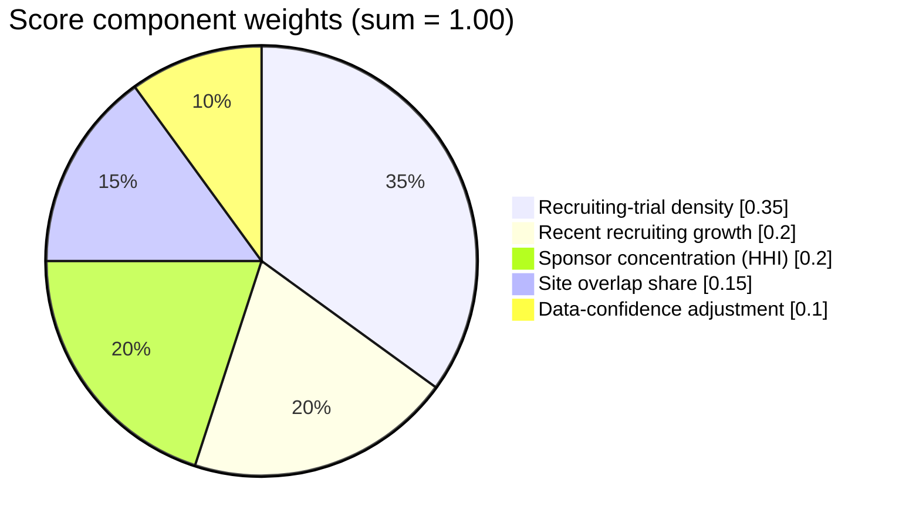

Component definitions:

| Component | Definition | Honesty mechanism |
|---|---|---|
| Density | `COUNT(DISTINCT nct_id)` recruiting in the segment, within one profile | never a per-capita claim (no population layer yet) |
| Growth | new recruiting trials in 90 days — **snapshot transitions** when ≥2 snapshots exist, else registry `study_first_post_date` proxy | `growth_uses_registry_proxy_flag` exposed per row; dashboard warns |
| Sponsor HHI | Σ(lead-sponsor share)² over segment listings | labeled listing concentration, not market share |
| Site overlap | share of segment trials listing a facility that appears on >1 recruiting trial | facility identity is best-effort name matching |
| Data confidence | 0.5 · record-quality-ok share + 0.5 · usable-location share | *raises* priority of well-documented segments; never punishes patients/sites |

**Banding** (thresholds are dbt vars, synchronized with `config/score_weights.yml`
and the seed CSV — a pytest test fails if the three ever diverge):

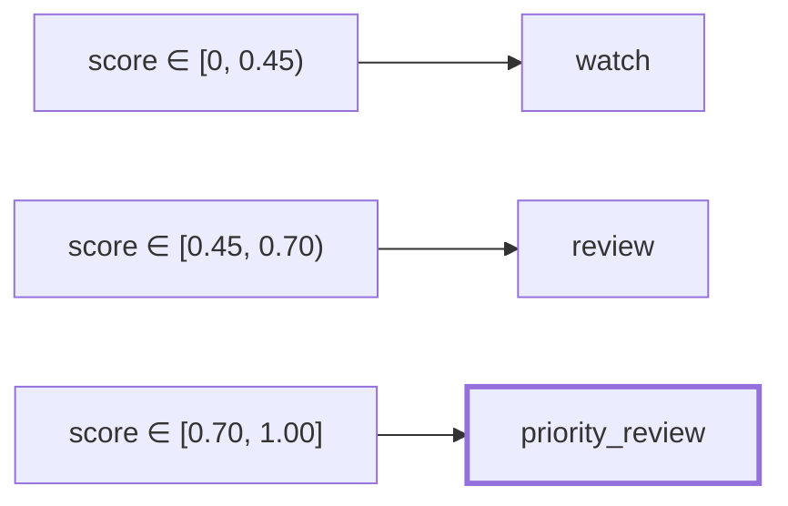

Distribution in the dated 2026-07-24 snapshot above (single profile, ADRD):
**449** segments → 374 `watch`, **75** `review`, 0 `priority_review` (expected on
single-snapshot history: the growth component still uses the registry proxy, and
top-band evidence is intentionally hard to reach). Regenerate it per profile with:

```sql
-- the queue already holds one row per segment at its profile's latest snapshot
select indication_profile_id, priority_band, count(*) as segments
from mart_feasibility_priority_queue
group by 1, 2
order by 1, 2;
```

Every row also ships:

- `priority_explanation` — a deterministic, template-generated sentence naming the
  dominant components (no free-text generation);
- `interpretation_note` — the fixed sentence *"Potential competition signal from
  public registry listings. Not a recruitment forecast; requires human feasibility
  review."*

---

## 11. Streamlit dashboard

`make dashboard` → http://localhost:8501. Eight pages, all read-only.

The sidebar's profile selector (`dashboard/components/profile.py`) picks which
indication profile every page renders. Its options come from the registry —
`get_registry().refreshable()`, i.e. `config/profiles/*.yml` minus the
`ingest_only` ones, which is why the full-catalog profile has no tab — not from a
`select distinct` over the warehouse, so a freshly mounted volume with no
warehouse yet still renders. The warehouse holds all profiles side by
side, but a single page view is scoped to exactly one, so no chart mixes
denominators across two registry queries.

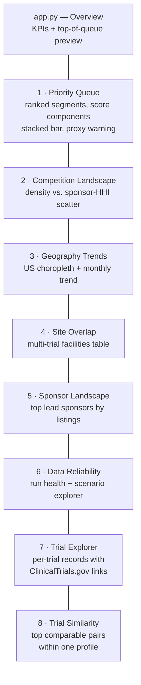

| Guardrail | Enforcement |
|---|---|
| Disclaimer banner on every page | shared `page_setup()`; a pytest test greps every page source for the call |
| Growth-proxy warning | shown whenever any displayed row has `growth_uses_registry_proxy_flag` |
| Read-only warehouse | `duckdb.connect(..., read_only=True)` behind `st.cache_resource` |
| Query caching | `st.cache_data(ttl=600)` |
| Scenario explorer never writes | sliders adjust session-only copies of `config/roi_assumptions.yml` |
| Trial links | `registry_url` column rendered with `st.column_config.LinkColumn` — opens the authoritative public record |

The page-6 **scenario explorer** replaces fake ROI claims: users plug in *their own*
cost assumptions (review cost, deprioritized-share, activation cost, influence share)
under conservative/base/optimistic multipliers; the arithmetic is pure
multiplication, and the disclaimer renders above every result.

---

## 12. Data quality framework

Quality gates run at every layer; failures block promotion of the affected data.

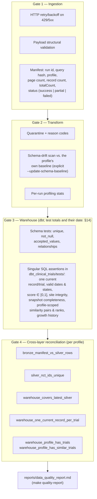

**Severity philosophy:** `error` = structural invariants this pipeline controls
(grains, keys, reconciliation); `warn` = registry messiness the pipeline must
tolerate and report (odd dates, missing fields) — real-world messiness is surfaced,
not hidden and not fatal.

Every reconciliation check carries the `profile_id` it is about; there is no
cross-profile check, because comparing two profiles' row counts would be a
meaningless comparison dressed up as an invariant (see
`src/quality/reconciliation.py`). The last generated run of the report in this
repository is `reports/data_quality_report.md`, stamped
`Generated: 2026-09-05T01:32:21+00:00 (UTC)` with **4/4 reconciliation checks
passed** on a single ADRD snapshot of 2,618 records; regenerate it with
`make quality-report`.

---

## 13. Clinical interpretation guardrails

The project's language rules are mechanical, not aspirational:

| Prohibited claim | Why | Mechanical control |
|---|---|---|
| "Site X is failing to recruit" | registry status ≠ operational truth | no site-performance metric exists in any mart |
| "Patients are available in state Y" | no participant-level data exists | density metrics labeled *listing* counts |
| "Sponsor Z is underperforming" | listings ≠ performance | sponsor mart shows listing counts only |
| Any contact/investigator info | privacy by design | `stg_trial_contacts` is empty by construction; smoke test asserts no such columns render |
| Predicted enrollment / ROI | would be invented | score is a *ranking*, scenario calculator uses only user-supplied assumptions |

Every scored row carries `interpretation_note`; every dashboard page carries the
banner; every document (including this one) opens with the planning-signal rule.

## 14. Testing and verification

| Suite | Count | Scope |
|---|---|---|
| dbt data tests | **138** (measured 2026-09-07 UTC: `uv run dbt parse --project-dir dbt_clinical_trials --profiles-dir dbt_clinical_trials`, then count `resource_type == "test"` in `dbt_clinical_trials/target/manifest.json`) | grains, keys, referential integrity, accepted values, score bounds, current-record uniqueness, state validity, date sanity |
| pytest | **299** (measured 2026-09-07 UTC: `uv run pytest --collect-only`) | HTTP client/retry, pagination, manifests, normalization, metric math (weights sync, min-max edge cases, HHI fixtures), ROI arithmetic + disclaimer, dashboard smoke (all 8 pages via Streamlit `AppTest`) |
| ruff | clean | lint + format, line length 100 |

These are the only places in this file that state those two counts *as measurements*,
which is the convention the rest of the repository follows (the §4 tree comment names
`138` once, purely to point here, in a phrasing the guard does not read as a count
claim): `docs/competitive_positioning.md`
carries its own dated copy, and
[`tests/test_docs_describe_current_paths.py`](tests/test_docs_describe_current_paths.py)
fails the build when *that* row falls behind the commands above, or when a live
document asserts a dbt or pytest count — phrased the way that guard recognises, and
the recognised shapes are listed in the file — that is neither dated nor equal to
what the tools report. Two exemptions, both stated in the guard: `docs/DEPLOY_FLY.md`
and `docs/development_log.md` are dated records, and so is **any tracked markdown
file whose own name contains a `YYYY-MM-DD` date** (`docs/platform_updates_2026-09-04.md`
today) — naming a *live* document after a date therefore removes it from the guard,
which its own test pins by asserting the exempt set. Dated figures — including the
2026-07-24 run below — are deliberately left alone: rewriting a dated measurement is
worse than the staleness the guard removes.

Last full verification (2026-07-24): `dbt build` **105/105 PASS** (3 seeds,
15 tables, 15 views, 72 tests at that run; now 73 after the `registry_url` test),
`pytest` **47/47**, dashboard HTTP 200 with all pages exercised.

Operational note: the dashboard smoke tests and a live dashboard server cannot share
the DuckDB file — stop the server before running `make test`.

---

## 15. Runbook — commands and operations

### First-time setup

```bash
git clone <repo-url> cti-dashboard
cd cti-dashboard
make setup            # uv sync, .env, data/ directories
```

### Full pipeline

```bash
make pipeline         # orchestrate → prune-data → dbt-run → dbt-test → quality-report
make dashboard        # http://localhost:8501
```

### Individual stages

| Command | What it does |
|---|---|
| `make ingest` | incremental bronze snapshot for ADRD (skips if a recent complete run exists) |
| `make full-refresh` | force a complete re-pull as a new run |
| `make ingest-full-catalog` | opt-in snapshot of full registry across all conditions worldwide |
| `make orchestrate` | fan out ingest + transform across all discovered profiles in `config/profiles/` |
| `make orchestrate-full-refresh` | force full ingest + transform across all discovered profiles |
| `make transform` | bronze → silver Parquet (+ profiling, quarantine, drift scan) |
| `make dbt-deps` / `dbt-run` / `dbt-test` / `dbt-docs` | warehouse build, tests, docs |
| `make quality-report` | write `reports/data_quality_report.md`; exit 1 if a reconciliation check failed |
| `make test` / `lint` / `format` | pytest / ruff check / ruff format |
| `make clean` | remove caches and build artifacts (**never** touches `data/`) |

### Weekly snapshot cadence

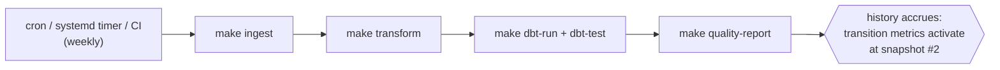

Each additional snapshot deepens `fct_trial_snapshot`; at two or more snapshots the
growth component automatically switches from the registry proxy to true
status-transition counts (and `growth_uses_registry_proxy_flag` flips off).

## 16. Configuration reference

| File | Controls |
|---|---|
| `config/profiles/*.yml` | Indication profiles: API query, status/type filters, page size, bronze paths, taxonomy & score-weight references |
| `config/profiles/adrd.yml` | ADRD indication profile (migrated from `project_config.yml`) |
| `config/profiles/full_catalog.yml` | Opt-in full registry profile (`ingest_only: true`) |
| `config/shared_paths.yml` | Shared silver, gold, and DuckDB paths across non-ingest-only profiles |
| `config/condition_taxonomy.yml` | mapping of registry condition strings → ADRD condition groups, with confidence rules |
| `config/geography_rules.yml` | state-name → USPS code normalization |
| `config/score_weights.yml` | score weights, normalization method, band thresholds (mirrored in seed + dbt vars; sync enforced by pytest) |
| `config/roi_assumptions.yml` | scenario-calculator assumptions and multipliers (with embedded disclaimer) |
| `.env` | optional local overrides (`CTI_CONFIG_PATH`, `CTI_HTTP_TIMEOUT_SECONDS`, `CTI_MAX_RETRIES`) — no secrets required |
| `dbt_clinical_trials/dbt_project.yml` | schema routing, seed types, feasibility band vars |

## 17. Known limitations

1. **Registry lag** — statuses can trail real-world operations by weeks; listing ≠
   verified activity.
2. **Single-snapshot history (currently)** — transition-based metrics are honestly
   zero/proxy-flagged until weekly snapshots accumulate.
3. **Facility identity is fuzzy** — names are not stable identifiers; overlap
   metrics are best-effort normalized-name matches.
4. **No population adjustment** — density is absolute, not per-capita, until an ACS
   layer is added.
5. **Condition mapping is rule-based** — taxonomy confidence is tracked and
   low-confidence share is reported, but mapping is not clinically adjudicated.
6. **Portfolio demonstration** — real feasibility decisions require qualified
   clinical-operations review and primary outreach.

## 18. Roadmap

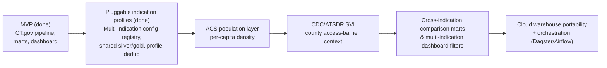

## 19. Documentation index

| Document | Purpose |
|---|---|
| [`README.md`](README.md) | front door: setup, scope, methodology summary |
| [`docs/architecture.md`](docs/architecture.md) | layer-by-layer architecture detail |
| [`docs/source_documentation.md`](docs/source_documentation.md) | API v2 endpoint, parameters, pagination, snapshot rationale |
| [`docs/data_dictionary.md`](docs/data_dictionary.md) | every object and column, silver + gold |
| [`docs/metric_definitions.md`](docs/metric_definitions.md) | formal definition + denominator + guardrail per metric |
| [`docs/data_quality_framework.md`](docs/data_quality_framework.md) | gates, tests, severity philosophy |
| [`docs/clinical_interpretation_guardrails.md`](docs/clinical_interpretation_guardrails.md) | prohibited claims and required framing |
| [`docs/assumptions_and_limitations.md`](docs/assumptions_and_limitations.md) | expanded limitations |
| [`docs/dashboard_spec.md`](docs/dashboard_spec.md) | page-by-page dashboard specification |
| [`docs/executive_memo_template.md`](docs/executive_memo_template.md) | fill-in memo with live example figures |
| [`docs/development_log.md`](docs/development_log.md) | complete step-by-step build record, phases 1–7 |

## 20. Glossary

| Term | Meaning here |
|---|---|
| **NCT ID** | ClinicalTrials.gov registry identifier (e.g. `NCT07721467`) — the only stable trial key |
| **Snapshot** | one complete ingestion run's view of all matching current records |
| **Segment** | a condition group × U.S. state × phase combination |
| **Run ID** | unique identifier minted per ingestion run; partitions bronze and silver |
| **Manifest** | per-run JSON recording pages, counts, hashes, and completion status |
| **HHI** | Herfindahl–Hirschman Index of lead-sponsor listing shares within a segment |
| **Proxy growth** | growth measured from registry first-post dates when snapshot history is insufficient (always flagged) |
| **Quarantine** | storage for records rejected at transform time, with reason codes |
| **Priority band** | `watch` / `review` / `priority_review` — a queueing label, not a verdict |

---

**Disclaimer:** Source: ClinicalTrials.gov public registry data (NLM). This project
is an analytical portfolio demonstration. All metrics are feasibility-review
planning signals — not enrollment forecasts, not clinical decision support, and not
judgments of any site, sponsor, or population. Validate with qualified
clinical-operations teams before any real-world use.
