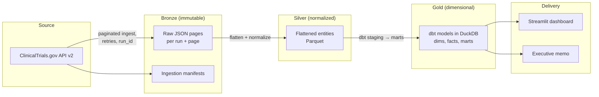
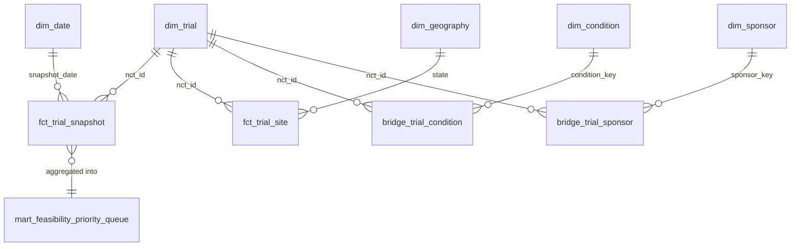

# Clinical Trial Access & Feasibility Intelligence

[](https://github.com/ne1cc/cti-dashboard/actions/workflows/ci.yml)

**Live demo:** [cti-dashboard.fly.dev](https://cti-dashboard.fly.dev/)

**A clinical-operations analyst preparing a feasibility review needs to decide
which condition–phase–geography segments, study records and evidence gaps to
investigate next.** The assumed current workflow involves collecting registry
listings, reconciling filters in spreadsheets and assembling evidence for a reviewer.
Repeated manual comparisons can consume preparation time and make results difficult
to reproduce. That workflow and its consequences still require stakeholder validation.

This project turns public **ClinicalTrials.gov API v2** records into an inspectable
study landscape with contributing NCT IDs, coverage caveats and an exportable audit.
The analyst selects a condition, phase and captured snapshot, compares distinct
study counts, inspects the underlying records, then prepares a scoped research
shortlist and follow-up questions for qualified feasibility review.

Success would mean less time preparing a comparable review, more complete evidence
handoffs and easier reproduction of published counts. Baselines and targets have
not been measured. Counts describe registry listings under the displayed rules;
they do not establish patient availability, recruitment prospects or site performance.

**Start here:** [Business case](docs/business_case.md) ·
[Project brief](docs/project_brief.md) ·
[National Phase 3 Alzheimer's disease case study](docs/feasibility_case_study.md) ·
[Metric definitions](docs/metric_definitions.md).
The case study uses an actual local captured dataset and a complete 50-state table;
D.C. and territories appear in a separate supplement. Its observations describe
that dataset, rather than the current live demo.

> **Validation status:** Calculation and pipeline checks are implemented. The
> proposed stakeholder workflow and business benefits have not been validated
> through stakeholder interviews or a measured operational evaluation.

---

## Decision workflow and operational output

Agree on scope → compare the captured landscape → inspect contributors and gaps →
export evidence → prepare a research shortlist and questions for further review.

The dashboard and audit supply the evidence; the analyst writes the handoff memo.
The memo should identify the selected scope, observations, contributing studies,
coverage limitations and information to confirm next. The optional weighted
review-priority score offers transparent ordering, but its operational usefulness
is unvalidated and its bands are not intervention or site-activation thresholds.

Weekly snapshots are the proposed collection cadence. Capture age and registry
source age are shown separately; a recent capture can contain an older source
record. Freshness expectations must be agreed with the reviewer before operational
use. There is no enforced freshness SLA.

## Why this needs recurring engineering

A spreadsheet or one-off registry analysis can be sufficient for an isolated
question. Repeated reviews need consistent filters and definitions, distinct-study
deduplication, retained observations and evidence that a reviewer can inspect.

- **Snapshot history:** Captures reported changes over successive runs from an
  API that supplies current records; history begins with this project's collection.
- **Shared metric definitions:** dbt models in DuckDB keep counts and grains
  consistent across the landscape, drill-through and exports.
- **Inspectable evidence:** Contributing NCT IDs, coverage, exclusions and source
  lineage explain what a count includes and what remains unknown.
- **Reliable delivery:** Python ingestion, typed Parquet entities, quality checks
  and CI support reproducible preparation of the Streamlit views and audit exports.

The [business case](docs/business_case.md) defines the proposed evaluation:
preparation minutes per comparable review, completeness of required handoff fields,
and successful count reproduction. The captured
[national case study](docs/feasibility_case_study.md) demonstrates calculation and
evidence preparation; stakeholder adoption and business improvement remain unmeasured.

---

## 5. Architecture diagram



Full detail: [`docs/architecture.md`](docs/architecture.md).

## 6. Data model diagram



## 7. Project scope

- **Therapeutic area:** Alzheimer's disease and related dementias (config-driven taxonomy).
- **Geography:** United States (all raw records preserved; U.S.-only in marts).
- **Study type:** Interventional.
- **Statuses:** RECRUITING, ACTIVE_NOT_RECRUITING, NOT_YET_RECRUITING, COMPLETED.
- **Phases:** EARLY_PHASE1 – PHASE4 where available.
- **Cadence:** Weekly snapshots; history accrues from this project's own runs.

## 7a. Optional: full-catalog ingestion

An opt-in, additive ingestion profile snapshots the **entire** ClinicalTrials.gov
registry — all conditions, worldwide, no status/type filter (~600k+ studies as of
this writing). Run it with `make ingest-full-catalog` (equivalently
`python -m src.cli ingest --profile full_catalog`). It writes to a completely
separate bronze tree (`data/bronze/full_catalog/`, declared in
`config/profiles/full_catalog.yml`) and cannot interfere with the default
ADRD/US pipeline above. Combining `--condition` with this profile is rejected:
the profile's scope is all conditions by definition.

**Bronze only.** That profile is marked `ingest_only`, so
`python -m src.cli transform --profile full_catalog` refuses with exit code 2:
there is no condition taxonomy to group trials by, and a taxonomy-less silver
tree would be misleading rather than useful. Its former
`make transform-full-catalog` target and the private silver tree it wrote are
retired; `python -m src.cli transform --profile <id>` flattens one named profile
from its own manifests under `data/bronze/<profile_id>/manifests/` (a bare
`make transform` is the legacy `default` alias, i.e. `adrd`), and
`make orchestrate` runs every refreshable profile end to end (the migration
record is in [`docs/development_log.md`](docs/development_log.md)). The chunked streaming
writer that target used
(`src/transform/export_parquet.py`: bounded-memory Parquet row groups, no
full-run materialization) is the same one every transformable profile writes
through. Gold, dbt marts, and the dashboard read the single shared silver root,
so full-catalog bronze reaches the warehouse only when a taxonomy exists for
it; see [`docs/architecture.md`](docs/architecture.md) for the remaining
scaling work (extending the condition/geography rules beyond ADRD/US).

## 8. Setup instructions

Prerequisites: Python 3.11+, [uv](https://docs.astral.sh/uv/), `make`.

```bash
git clone <your-repo-url> cti-dashboard
cd cti-dashboard
make setup
```

## 9. Installation (uv)

`make setup` runs `uv sync --all-groups`, copies `.env.example` → `.env`, and creates
the git-ignored `data/` directories. Dependencies are declared in
[`pyproject.toml`](pyproject.toml).

## 10. Environment configuration

Copy [`.env.example`](.env.example) to `.env`. No API keys are needed — the API is
public. Variables control local paths, logging, and optional HTTP overrides.

## 11. How to run a first ingestion

```bash
make ingest                      # python -m src.cli ingest --condition "Alzheimer Disease"
```

For the opt-in full-catalog profile instead, see [section 7a](#7a-optional-full-catalog-ingestion).

## 12. How to run repeat snapshots

Run `make ingest` weekly (cron, systemd timer, or GitHub Actions). Each run gets a
unique `ingestion_run_id`; completed runs are never silently re-downloaded
(incremental default), and `make full-refresh` forces a complete re-pull.

## 13. How to run dbt models and tests

```bash
make dbt-run
make dbt-test
```

## 14. How to build the data-quality report

```bash
make quality-report
```

## 14a. How to run the orchestrator locally

```bash
make dbt-deps                     # one-time: dbt packages
uv run dbt parse --project-dir dbt_clinical_trials --profiles-dir dbt_clinical_trials
uv run dagster dev -m src.orchestration.definitions
```

`dagster dev` opens the web UI at http://localhost:3000 showing the bronze→silver→gold
asset graph. Materialize assets manually from the UI, or execute the weekly job
headlessly:

```bash
uv run dagster job execute -m src.orchestration.definitions -j weekly_refresh
```

Headless execution hits the real ClinicalTrials.gov API; local `dagster dev` is for
inspection, manual materializations, and ad-hoc re-runs (backfills are deliberately
not part of the design).

## 15. How to start the Streamlit dashboard

```bash
make dashboard
```

## 16. Data model and grains

| Layer | Object | Grain |
|---|---|---|
| Silver | `silver_trials` | NCT ID × ingestion run |
| Silver | `silver_trial_locations` | profile × NCT ID × run × original location ordinal |
| Gold | `dim_trial` | NCT ID |
| Gold | `fct_trial_snapshot` | NCT ID × snapshot date |
| Gold | `fct_trial_site` | NCT ID × facility × city × state × snapshot date |
| Gold | `mart_feasibility_priority_queue` | condition group × state × phase × latest snapshot |

## 17. Metric definitions

Fully documented in [`docs/metric_definitions.md`](docs/metric_definitions.md). Core
rules: trial counts are always `COUNT(DISTINCT nct_id)`; site counts use the documented
facility grain and are never presented as investigator capacity; only complete
(`success`) snapshots feed metrics.

## 18. Feasibility score methodology

Weighted min-max-normalized components (weights in `config/score_weights.yml` and a
dbt seed): recruiting-trial count (0.35), recent recruiting growth (0.20), sponsor
concentration (0.20), site overlap (0.15), legacy operational completeness adjustment (0.10). All
components, denominators, and deterministic explanations are displayed.

## 19. Data-quality and clinical interpretation guardrails

Automated checks cover ingestion integrity, trial validation, relationship integrity,
geographic validity, and metric rules — 157 dbt data tests plus a 383-test pytest suite
(measured 2026-10-03 UTC; regenerate with `uv run dbt parse --project-dir
dbt_clinical_trials --profiles-dir dbt_clinical_trials` and
`uv run pytest --collect-only`. `tests/test_docs_describe_current_paths.py` fails the
build when a live document states a dbt or pytest count — phrased the way that guard
recognises, and the recognised shapes are listed in it — that is neither dated nor
equal to what those commands report), cross-layer reconciliation, and schema-drift
detection ([`docs/data_quality_framework.md`](docs/data_quality_framework.md)). Interpretation
guardrails prohibit claims about recruitment failure, patient eligibility, healthcare
quality, or sponsor performance
([`docs/clinical_interpretation_guardrails.md`](docs/clinical_interpretation_guardrails.md)).

## 20. Limitations

- Registry records can be incomplete, delayed, or inconsistently updated.
- Status history begins when this project's snapshots begin.
- Facility names are not stable unique identifiers; normalization is best-effort.
- Raw recruiting counts are not population-adjusted.
- Portfolio demonstration only; real decisions require qualified clinical-operations review.

## 21. Scenario-value methodology

No fake ROI. A configurable scenario calculator (`config/roi_assumptions.yml`) lets an
organization test whether a feasibility-review process could justify its cost using
*its own* site-startup and study-burn assumptions, under low/base/high scenarios.

## 22. Documentation index

| Document | Contents |
|---|---|
| [`PROJECT_DOCUMENTATION.md`](PROJECT_DOCUMENTATION.md) | complete project documentation with architecture, data-model, and flow diagrams |
| [`docs/study_guide.md`](docs/study_guide.md) | guided learning path: run it, trace a record, read the code, exercises |
| [`docs/architecture.md`](docs/architecture.md) | pipeline and layer design |
| [`docs/data_dictionary.md`](docs/data_dictionary.md) | every layer, entity, and column |
| [`docs/source_documentation.md`](docs/source_documentation.md) | API v2 usage, verification, history caveat |
| [`docs/metric_definitions.md`](docs/metric_definitions.md) | formula + grain for every metric and the score |
| [`docs/clinical_interpretation_guardrails.md`](docs/clinical_interpretation_guardrails.md) | required/prohibited language, enforcement |
| [`docs/assumptions_and_limitations.md`](docs/assumptions_and_limitations.md) | numbered assumptions register |
| [`docs/data_quality_framework.md`](docs/data_quality_framework.md) | five check layers, tests, severity philosophy |
| [`docs/dashboard_spec.md`](docs/dashboard_spec.md) | page-by-page dashboard specification |
| [`docs/project_brief.md`](docs/project_brief.md) | proposed stakeholder workflow, scope and acceptance criteria |
| [`docs/feasibility_case_study.md`](docs/feasibility_case_study.md) | actual national descriptive memo, complete state table and evidence appendix |
| [`docs/executive_memo_template.md`](docs/executive_memo_template.md) | stakeholder memo template with required scope and evidence references |
| [`docs/development_log.md`](docs/development_log.md) | complete step-by-step build record (Phases 1–7) |
| [`docs/DEPLOY_STREAMLIT.md`](docs/DEPLOY_STREAMLIT.md) | deploy the dashboard to Streamlit Community Cloud |
| [`docs/DEPLOY_FLY.md`](docs/DEPLOY_FLY.md) | deploy the dashboard to Fly.io with an auto-refreshing pipeline |
| [`docs/competitive_positioning.md`](docs/competitive_positioning.md) | how CTI's free registry-only scope compares to Citeline/IQVIA/H1, and where that leaves room to grow |

## 23. Roadmap

1. MVP: ClinicalTrials.gov-only pipeline, marts, dashboard (Phases 1–7).
2. ACS population layer for population-adjusted density.
3. CDC/ATSDR SVI county-level access-barrier context.
4. Optional oncology module via NCI CTS API.
5. Warehouse portability (BigQuery/Snowflake) and orchestration (Dagster/Airflow).

---

**Disclaimer:** Source: ClinicalTrials.gov public registry data. This project is an
analytical portfolio demonstration. Metrics are feasibility-review signals, not
enrollment forecasts. Validate with qualified clinical-operations teams before any
real-world use.

## Competition audit drill-through

Open **Data coverage and caveats** on any competition-bearing page to inspect the
selected metric's definition, exact filters, profile/run IDs, contributing NCT IDs,
exclusive exclusions, overlapping warnings and original recorded locations. Sidebar
scope and a selected segment/sponsor/facility refinement are recorded separately.
Distinct-study totals deduplicate across overlapping segments. Geography uses reported
U.S. country/state; unresolved membership stays in the eligible denominator without
claiming it belongs to a selected state. Location status does not gate confirmed
overall `RECRUITING` counts. Missing facility text does not erase valid state geography.

The panel separates pipeline age, posted-update day age and verification month age,
with raw dates and precision retained. Its configurable project-defined warning
(default >180 days) retains records. Enrollment categories distinguish estimated targets, reported actual,
missing counts and unknown types; study totals are never apportioned to sites.
Download the JSON audit for selected run IDs/dates, `competition-audit-v2`, active
rule hashes, evaluation UTC, threshold, decisions, contributors, enrollment and raw
page/ordinal/hash lineage, qualifying growth/proxy events and predecessor evidence.
The audit retains wider eligible/count-input denominators; unrelated derived formulas,
windows and warehouse values are disclosed rather than recalculated from the union.
See [metric definitions](docs/metric_definitions.md) and
[data dictionary](docs/data_dictionary.md) for exact grains, formulas and identity limits.

Existing silver must be rebuilt from retained profile bronze, followed by dbt rebuild,
to expose new provenance columns. For each transformable profile, run
`uv run python -m src.cli transform --profile <id> --force`, then `make dbt-run dbt-test`;
no registry refresh is needed for this rebuild.
Historical page receipt metadata remains unknown. Bronze pruning can remove referenced
pages, and active hashes do not establish historical configuration identity.

Registry-derived signals support preliminary feasibility review. They do not measure site-level recruitment performance or establish scientific validity. Counts reflect captured public records and the displayed inclusion rules.
