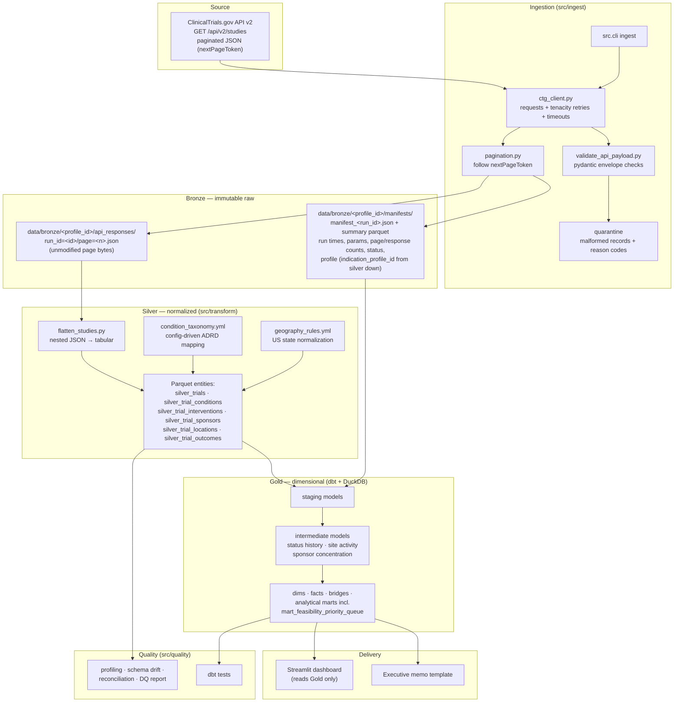
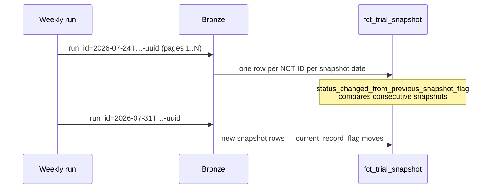

# Architecture

Clinical Trial Access & Recruitment Competition Intelligence is a local-first,
medallion-architecture analytics platform. Every layer is reproducible from the layer
below it, and the bronze layer is immutable so any downstream logic change can be
replayed against the exact bytes originally received from the source.

## 1. System overview

## 2. Layer contracts

### Bronze — immutable raw
- One JSON file per API page per ingestion run: `run_id=<run_id>/page=<page>.json`,
  saved byte-for-byte before any parsing beyond envelope validation.
- One manifest per run: run ID (UTC timestamp + UUID), start/end time, endpoint,
  full query parameters, page count, response count, success/failure state.
- Never edited, never deleted by pipeline code. Re-runs create new run IDs;
  completed runs are not re-downloaded in incremental mode.
- Malformed records go to a quarantine report with reason codes — never dropped
  silently.

### Silver — clean normalized entities
- Flattened, typed, standardized Parquet per entity, grain = source entity ×
  ingestion run (see `docs/data_dictionary.md`, Phase 4+).
- Config-driven condition taxonomy and geography rules (version-controlled YAML;
  no runtime LLM classification).
- Data-quality flags (`record_quality_flag`, `usable_geography_flag`,
  `dementia_relevance_flag`) computed here, not in dashboards.
- All records preserved, including non-U.S. locations excluded from MVP marts.

### Gold — business-ready dimensional model
- Built exclusively by dbt (dbt-duckdb) inside `data/warehouse/clinical_trials.duckdb`.
- Staging → intermediate → marts; each layer documents and tests its grain.
- Snapshot facts turn repeated ingestion runs into longitudinal status history —
  the source API only serves current records.
- The dashboard reads Gold marts only; no dashboard-side business logic.

## 3. Snapshot-history design

Key consequence: history depth equals the age of this project's own snapshot
collection. This is documented, not hidden.

## 4. Technology choices

| Concern | Choice | Rationale |
|---|---|---|
| Dependency mgmt | uv | Fast, lockfile-based, reproducible |
| HTTP | requests + tenacity | Timeouts, typed exceptions, exponential backoff |
| Validation | pydantic v2 | Envelope/schema validation with clear errors |
| Storage | Parquet + DuckDB | Local-first, columnar, zero-ops warehouse |
| Modeling | dbt-duckdb | Tested, documented, grain-safe SQL layers |
| Dashboard | Streamlit + Plotly | Fast decision-ready delivery from Gold marts |
| CI | GitHub Actions | Lint, unit tests, dbt build on synthetic fixtures |

## 5. Reproducibility and operations

- `Makefile` is the single entry point (`make pipeline` = orchestrate → prune-data → dbt-run → dbt-test → quality-report).
- All query parameters, taxonomy, geography rules, score weights, and scenario
  assumptions live in `config/*.yml` under version control.
- `.env` carries only local paths/log levels — no secrets exist in this project.
- Logging via loguru with run-context fields; no sensitive data is ever logged
  (the source is public, but site contacts/investigators are still excluded from
  all delivery surfaces).

## 6. Scaling path (implemented extensions, and the roadmap beyond them)

- **Full-catalog bronze ingestion (implemented, opt-in).** `config/profiles/full_catalog.yml`
  drops the `query.cond`/`filter.*` params entirely and runs against a parallel
  `data/bronze/full_catalog/` tree (`make ingest-full-catalog`), snapshotting the
  entire ClinicalTrials.gov registry (~600k+ studies, estimated) instead of just
  ADRD/US. It shares every ingestion primitive with the default profile
  (`iter_pages`, `CTGClient`, manifest/reuse logic) — only the config differs —
  and is invisible to `make transform`/`dbt-run`/dashboard: the profile is marked
  `ingest_only`, so `transform --profile full_catalog` is refused with exit code 2
  rather than writing a taxonomy-less silver tree, and the default transform reads
  only `data/bronze/adrd/manifests/`.
- **Multi-indication (implemented).** An indication profile is one YAML file in
  `config/profiles/`, the registry loads all of them, and `make orchestrate`
  refreshes every profile that is not `ingest_only` into the *same* warehouse. The
  trial grain is `(nct_id, indication_profile_id)`, carried through staging,
  intermediate and mart models, while silver, gold and the DuckDB file stay shared
  (`config/shared_paths.yml`) — the profile column is what keeps two indications
  from cross-joining on a shared date. Reconciliation is per profile
  (`src/quality/reconciliation.py` binds `indication_profile_id` into every check),
  the dashboard serves one profile at a time (`dashboard/components/profile.py`
  renders the selector, `dashboard/components/data.py` binds it into every query),
  and `make prune-data` keeps `bronze_runs_to_keep` *success* runs per profile —
  the horizon is declared in that profile's `retention:` block, not in code
  (`src/utils/retention.py` refuses a bronze horizon deeper than the snapshot
  horizon). Adding an indication means adding a config file and a taxonomy, not
  forking the pipeline: `config/profiles/oncology_nsclc.yml` is the worked example.
- **Chunked silver transform (implemented).** `SilverRunWriter`
  (`src/transform/export_parquet.py`) streams flattened rows into one Parquet
  file per entity per run, flushing a row group every 50k rows against fixed
  `ENTITY_ARROW_SCHEMAS` (pandas inference cannot survive chunking: an all-null
  chunk would infer Arrow `null`), staging to `.tmp` and atomically renaming on
  close. `build_silver_for_run` no longer materializes a full run in memory;
  profiling (`src/quality/profiling.py`) is a single DuckDB streaming aggregate
  instead of a full pandas re-read. Every profile `transform` accepts writes
  through this same writer into the single shared silver root
  (`data/silver/`, from `config/shared_paths.yml`); gold, dbt, and the dashboard
  read that root, so a profile reaches the warehouse only once it has a taxonomy
  and is no longer `ingest_only`.
- Extending `condition_taxonomy.yml` and `geography_rules.yml` beyond their
  current ADRD/US-only scope (planned): the prerequisite before full-catalog
  silver data is meaningful in the marts.
- Swap dbt-duckdb profile for BigQuery/Snowflake; models are ANSI-leaning by design.
- Wrap CLI stages as Dagster/Airflow tasks keyed by `ingestion_run_id`.
- Add ACS population and CDC/ATSDR SVI layers only after the ClinicalTrials.gov-only
  MVP is complete, tested, and documented.
